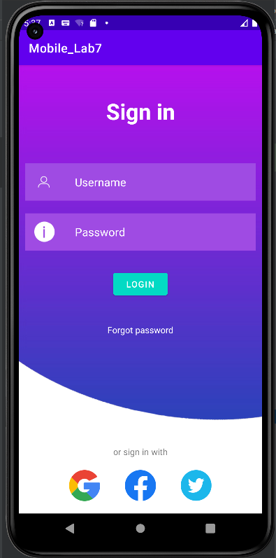
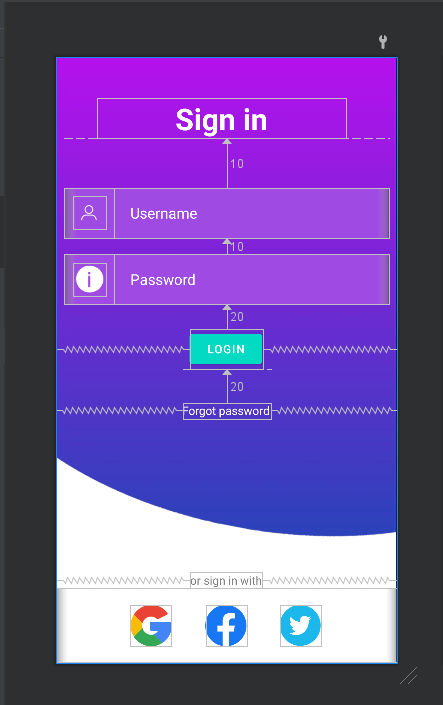

МИНИСТЕРСТВО НАУКИ И ВЫСШЕГО ОБРАЗОВАНИЯ
РОССИЙСКОЙ ФЕДЕРАЦИИ
ФЕДЕРАЛЬНОЕ ГОСУДАРСТВЕННОЕ БЮДЖЕТНОЕ
ОБРАЗОВАТЕЛЬНОЕ УЧРЕЖДЕНИЕ ВЫСШЕГО ОБРАЗОВАНИЯ
«САХАЛИНСКИЙ ГОСУДАРСТВЕННЫЙ УНИВЕРСИТЕТ»

      

Институт естественных наук и техносферной безопасности Кафедра информатики Чагочкин Никита

   

Лабораторная работа №7 «Макет». 01.03.02 Прикладная математика и информатика

            

Научный руководитель 
Соболев Евгений Игоревич

   

г. Южно-Сахалинск 2023 г.

***
# 
Сделать функциональный макет 

Необходимо реализовать макет по изображению использую материалы из архива lab7.zip, соблюдая отступы согласно рисунку.Реализовать простую авторизацию по логину паролю, при удачной попытке вывести пользователю сообщение об авторизации, если пароль логин неверный, то сообщение об ошибке.
***
## 
Решение

        <?xml version="1.0" encoding="utf-8"?>
        <RelativeLayout xmlns:android="http://schemas.android.com/apk/res/android"
        xmlns:app="http://schemas.android.com/apk/res-auto"
        xmlns:tools="http://schemas.android.com/tools"
        android:layout_width="match_parent"
        android:layout_height="match_parent"
        android:background="@drawable/background"
        android:orientation="vertical"
        >

        <TextView
            android:id="@+id/headerText"
            android:layout_width="300dp"
            android:layout_height="wrap_content"
            android:layout_margin="50dp"
            android:text="Sign in"
            android:textAlignment="center"
            android:textColor="@color/white"
            android:textSize="36dp"
            android:textStyle="bold"
            />

        <LinearLayout
            android:id="@+id/LinearLogin"
            android:layout_width="match_parent"
            android:layout_height="60dp"
            android:orientation="horizontal"
            android:layout_below="@+id/headerText"
            android:background="#9f4be3"
            android:layout_margin="10dp">

            <ImageView
                android:id="@+id/imageViewLogin"
                android:layout_width="40dp"
                android:layout_height="40dp"
                app:srcCompat="@drawable/userwhite"
                android:layout_margin="10dp"
                android:layout_gravity="center_vertical"/>
            <EditText
                android:id="@+id/loginText"
                android:inputType="text"
                android:layout_width="match_parent"
                android:layout_height="match_parent"
                android:background="@android:color/transparent"
                android:hint="Username"
                android:paddingLeft="20dp"
                android:textSize="18dp"
                android:textColor="@color/white"
                android:textColorHint="@color/white"/>
        </LinearLayout>
        <LinearLayout
            android:id="@+id/LinearPassword"
            android:layout_width="match_parent"
            android:layout_height="60dp"
            android:orientation="horizontal"
            android:layout_below="@+id/LinearLogin"
            android:background="#9f4be3"
            android:layout_margin="10dp">

            <ImageView
                android:id="@+id/imageViewPass"
                android:layout_width="40dp"
                android:layout_height="40dp"
                app:srcCompat="@drawable/passwd"
                android:layout_margin="10dp"
                android:layout_gravity="center_vertical"/>
            <EditText
                android:id="@+id/passwordText"
                android:inputType="textPassword"
                android:layout_width="match_parent"
                android:layout_height="match_parent"
                android:background="@android:color/transparent"
                android:hint="Password"
                android:paddingLeft="20dp"
                android:textSize="18dp"
                android:textColor="@color/white"
                android:textColorHint="@color/white"/>

        </LinearLayout>

        <Button
            android:id="@+id/button_signin"
            android:layout_width="wrap_content"
            android:layout_height="wrap_content"
            android:layout_below="@+id/LinearPassword"
            android:layout_centerHorizontal="true"
            android:layout_marginStart="20dp"
            android:layout_marginTop="20dp"
            android:layout_marginEnd="20dp"
            android:layout_marginBottom="20dp"
            android:backgroundTint="#03dac4"
            android:text="LOGIN" />

        <TextView
            android:id="@+id/forgotText"
            android:layout_width="wrap_content"
            android:layout_height="wrap_content"
            android:text="Forgot password"
            android:layout_below="@+id/button_signin"
            android:layout_centerHorizontal="true"
            android:layout_margin="20dp"
            android:textColor="@color/white"/>

        <TextView
            android:id="@+id/socialText"
            android:layout_width="wrap_content"
            android:layout_height="wrap_content"
            android:text="or sign in with"
            android:layout_centerHorizontal="true"
            android:textColor="#808080"
            android:layout_above="@+id/footerText"/>

        <LinearLayout
            android:id="@+id/footerText"
            android:layout_width="match_parent"
            android:layout_height="wrap_content"
            android:orientation="horizontal"
            android:layout_alignParentBottom="true"
            android:gravity="center"
            >

            <ImageView
                android:id="@+id/imageView2"
                android:layout_width="50dp"
                android:layout_height="50dp"
                android:layout_margin="20dp"
                app:srcCompat="@drawable/google" />

            <ImageView
                android:id="@+id/imageView3"
                android:layout_width="50dp"
                android:layout_height="50dp"
                android:layout_margin="20dp"
                app:srcCompat="@drawable/fb" />

            <ImageView
                android:id="@+id/imageView4"
                android:layout_width="50dp"
                android:layout_height="50dp"
                android:layout_margin="20dp"
                app:srcCompat="@drawable/twitter" />
        </LinearLayout>

        </RelativeLayout>

## 
Простая авторизация

        override fun onCreate(savedInstanceState: Bundle?) {
        super.onCreate(savedInstanceState)
        setContentView(R.layout.activity_main)
        signinButton=findViewById(R.id.button_signin)
        login=findViewById(R.id.loginText)
        password=findViewById(R.id.passwordText)
        forgotPass=findViewById(R.id.forgotText)
        signinButton.setOnClickListener{
            if(login.text.toString()==getString(R.string.true_login)&&password.text.toString()==getString(R.string.true_pass)){
                Toast.makeText(this,"sign in completed",Toast.LENGTH_LONG).show()
            }else{
                Toast.makeText(this,"Incorrect login or password",Toast.LENGTH_LONG).show()
            }
        }
        forgotPass.setOnClickListener {
            Toast.makeText(this,"Login: ${getString(R.string.true_login)}, Pass: ${ getString(R.string.true_pass)}",Toast.LENGTH_SHORT).show()
        }
    }

